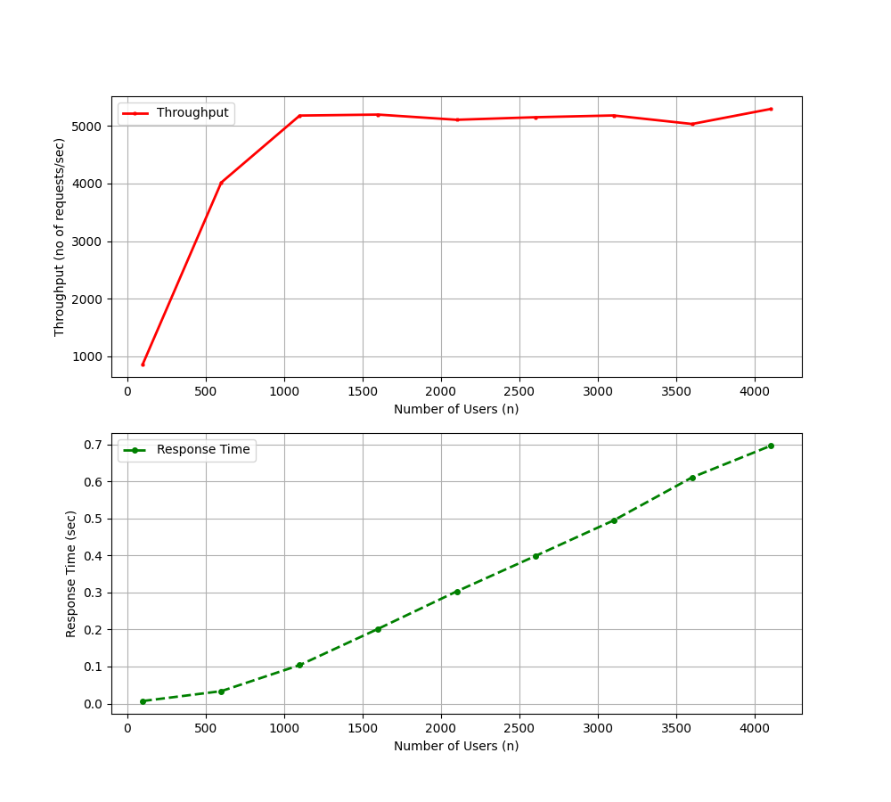

# Custom Web Server with Load Testing

## Project Overview

This project involves the creation of a custom web server using the C programming language. The web server is designed to handle HTTP GET requests from concurrent users, leveraging thread pooling for efficient request handling. Special attention was given to ensuring that the code is free of memory leaks.

Additionally, a closed-loop load generator was developed to simulate user access to the server by generating concurrent requests. This load generator is instrumental in analyzing performance metrics and identifying bottlenecks in the server.

## Key Features

### 1. **Custom Web Server**
   - **Language**: C
   - **Request Handling**: Capable of processing HTTP GET requests.
   - **Concurrency**: Utilizes thread pooling to handle requests from multiple users concurrently.
   - **Memory Management**: The server is designed with strict memory management to avoid memory leaks.

### 2. **Closed-Loop Load Generator**
   - **Purpose**: Simulates concurrent user access by generating X requests in a span of Y time.
   - **Focus**: Designed to analyze the server's performance under load and identify bottlenecks.
   - **Metrics**: The load generator measures key performance indicators such as response time, throughput, and resource utilization.

### 3. **Automation and Graphing**
   - **Automation**: Load generation is automated for consistent and repeatable testing.
   - **Graphing**: Performance metrics are visualized using Python and Matplotlib to create detailed graph plots.

## Implementation Details

### Web Server
- **Thread Pooling**: The server uses a fixed number of threads to handle incoming requests. Each thread processes requests from a shared queue, ensuring efficient utilization of resources.
- **Memory Management**: The code is structured to allocate and deallocate memory appropriately, avoiding memory leaks even under heavy load.

### Load Generator
- **Closed-Loop Design**: The generator issues requests to the web server, waits for a response, and then issues the next request after a predefined "think time."
- **Concurrency**: The generator can simulate a large number of concurrent users accessing the server.
- **Customization**: The number of concurrent requests (X) and the time span (Y) are configurable, allowing for flexible load testing scenarios.

### Automation and Graphing
- **Python Scripting**: The load generation process is automated using Python scripts.
- **Matplotlib**: Performance metrics are plotted using Matplotlib to visualize the server's behavior under load.

## Compilation and Running Guide

### Web Server

1. **Navigate to the Server Directory**:
   ```bash
   cd Server
   ```
2. **Compile the Web Server**:
    ```bash
    make
    ```
3. **Run the Web Server**:
    ```bash
    ./server
    ```
### Load Generator and Graph Plotting

1. **Navigate to the Load Generator Directory**:
    ```bash
    cd loadGenerator
    ```
2. **Run the Load Generator and Create Graph Plots**:
    ```bash
    python3 analysePerformance.py --host <host> --port <port> --min <min_concurrent_users> --max <max_concurrent_users> --jump <jump-next[OPTIONAL]> --thinktime <thinktime> --testingperiod <testing_period>
    ```
    - Arguments:
        - host: The IP address or hostname of the server.
        - port: The port number on which the server is running.
        - thinktime: Time delay (in seconds) between consecutive requests by a single user.
        - min_concurrent_users: The minimum number of concurrent users to simulate.
        - max_concurrent_users: The maximum number of concurrent users to simulate.
        - jump-next: Next concurrent user count will be (current+jumpnext). For instance if cuurent user count is 100 and jump is of 50 then next usercount will be 150. Helps in creating smooth graph plots.
        - testing_period: The duration (in seconds) over which to conduct the test.
- **Example**:
    ```bash
    python3 analysePerformance.py --host 127.0.0.1 --port 8080 --min 500 --max 4400 --jump 100 --thinktime 0.5 --testingperiod 60
    ```

## Results
### Performance Analysis
- **GET Request Handling**: The web server successfully handles basic HTTP GET requests without encountering any errors or memory leaks.
- **Bottleneck Identification**: Through the load testing, it was determined that the server's CPU becomes a bottleneck when handling approximately 1100 concurrent users with a 0.5-second think time per user.
### Graphical Results:
- The graph plots generated from the load testing show a clear increase in CPU utilization as the number of concurrent users approaches 1100. Beyond this point, the server's response time begins to degrade, indicating the onset of the CPU bottleneck.


## Conclusion
- This project demonstrates the development of a robust web server in C, capable of handling concurrent GET requests efficiently. The closed-loop load generator provides valuable insights into the server's performance, helping to identify CPU as the primary bottleneck under high load conditions. The automated testing and graphing tools ensure that performance analysis is both rigorous and repeatable.

## Future Enhancements
- Scalability: Investigate ways to distribute the load across multiple CPUs or servers to handle more concurrent users.
- Advanced Request Handling: Extend the server to handle more complex HTTP requests (e.g., POST, PUT).
- Memory Profiling: Further profiling to optimize memory usage under different load conditions.